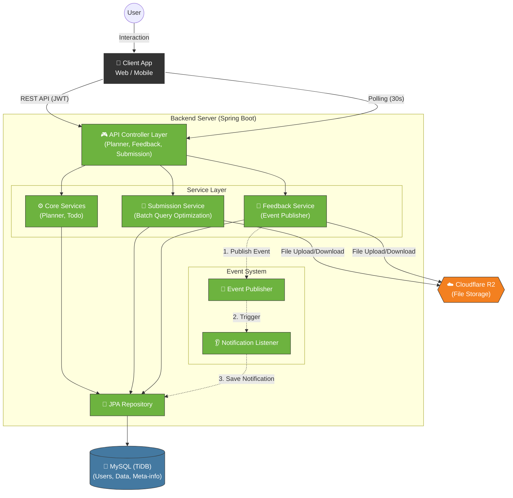

# 📚 설스터디 (SeolStudy) - 멘토링 기반 자기주도 학습 관리 플랫폼


> **설스터디**는 멘토와 멘티를 연결하여 체계적인 학습 계획(Planner)을 수립하고, 과제 제출 및 피드백을 통해 학습 효율을 극대화하는 멘토링 플랫폼입니다.

---

## 🚀 프로젝트 소개 (Introduction)

단순한 일정 관리를 넘어, 멘토가 멘티의 학습 방향을 잡아주는 **양방향 소통 학습 플랫폼**입니다.
멘토는 멘티에게 맞춤형 과제를 일괄 배정하고, 멘티는 과제를 수행하여 제출합니다. 제출된 과제에 대해 멘토는 텍스트 및 파일 첨부를 통해 상세한 피드백을 제공합니다.

### 🎯 주요 목표
* **효율적인 멘토링:** 멘토가 다수의 멘티에게 손쉽게 과제를 배정하고 관리할 수 있는 시스템 구축
* **학습 동기 부여:** 시각화된 진척도(Progress)와 실시간 알림을 통한 학습 독려
* **안정적인 시스템:** 대용량 파일 처리 및 N+1 문제 해결을 통한 성능 최적화

---

## 🛠 기술 스택 (Tech Stack)

### Backend
- **Language:** Java 17
- **Framework:** Spring Boot 3.x
- **Database:** MySQL (TiDB compatible)
- **ORM:** Spring Data JPA
- **Storage:** Cloudflare R2 (AWS S3 Compatible)

### Architecture & Design Pattern
- **Event-Driven Architecture:** `ApplicationEventPublisher`를 활용한 도메인 간 결합도 감소 (알림 시스템)
- **Polling Strategy:** 클라이언트 부하를 고려한 준실시간 알림 처리



---

## 🚀 배포 구조

- 백엔드 서버는 `dev` 브랜치를 기준으로 배포됩니다.
- Spring Boot 애플리케이션을 Docker 이미지로 빌드합니다.
- 빌드된 이미지는 Docker Hub에 업로드됩니다.
- Oracle Cloud VM에서 최신 이미지를 pull 받아 컨테이너로 실행합니다.
- Cloudflare Tunnel을 통해 인바운드 포트 개방 없이 외부 요청을 안전하게 처리합니다.
- 환경 변수 및 민감 정보는 서버 내부의 `.env` 파일로 관리합니다.

---

## ✨ 핵심 기능 (Key Features)

### 1️⃣ 학습 플래너 & 할 일 관리 (Planner & Todo)
* **멘토의 일괄 배정:** 멘토가 특정 기간(예: 월/수/금)을 설정하여 과제(Worksheet)를 한 번에 등록하는 **Batch Insert** 기능 구현.
* **멘티의 자율 학습:** 멘티 스스로 할 일을 등록하고 관리하는 자기주도 학습 기능.

### 2️⃣ 과제 제출 및 파일 처리 (Submission)
* **N:M 구조 대응:** 하나의 과제에 여러 학습지(Worksheet)가 연결될 수 있는 구조 설계.
* **Cloudflare R2 연동:** 과제 파일 및 피드백 첨부 파일을 R2 Object Storage에 업로드/다운로드하여 서버 부하 분산.

### 3️⃣ 멘토 피드백 시스템 (Feedback)
* **상세 피드백:** 텍스트뿐만 아니라 첨부 파일을 통해 구체적인 첨삭 제공.
* **권한 관리:** 본인이 작성한 피드백만 수정/삭제 가능하도록 정교한 ACL(Access Control List) 구현.
* **Soft Delete:** 데이터 보존을 위해 삭제 시 DB에는 Soft Delete, 스토리지에는 Hard Delete 적용.

### 4️⃣ 학습 진척도 분석 (Analytics)
* **정확한 데이터:** 단순 체크박스(`isCompleted`)가 아닌 **실제 과제 제출 여부(`Submission`)**를 기반으로 진척도 계산.
* **성능 최적화:** 기간 내 모든 과제의 제출 여부를 **Batch Query(`IN`절)**로 한 번에 조회하여 반복문 내 쿼리 발생(N+1 문제) 완벽 차단.

### 5️⃣ 알림 시스템 (Notification)
* **Event 기반 비동기 처리:** 댓글, 피드백, 과제 제출 시 비즈니스 로직과 알림 로직을 분리하여 확장성 확보.
* **주요 알림:**
    * 멘토 → 멘티: "피드백이 등록되었습니다", "과제가 배정되었습니다"
    * 멘티 → 멘토: "과제가 제출되었습니다"
    * 양방향: "댓글이 달렸습니다"

---

## 🔧 아키텍처 및 성능 개선 (Refactoring Log)

### ⚡ 진척도 계산 성능 최적화 (N+1 문제 해결)
> **문제:** 기간별 진척도 조회 시, 날짜/과목별 반복문 안에서 `Submission` 존재 여부를 매번 `SELECT` 하여 심각한 성능 저하 우려.
>
> **해결:**
> 1. 조회 기간 내의 **모든 Task ID**를 먼저 추출.
> 2. `SubmissionRepository`에서 `IN` 쿼리를 사용해 제출된 Task ID 목록을 **단 1회의 쿼리**로 조회.
> 3. 메모리 내 `HashSet`을 이용하여 **O(1)** 속도로 제출 여부 매칭.

### 🔔 알림 시스템 의존성 분리
> **문제:** `FeedbackService`나 `TodoService`가 `NotificationService`를 직접 의존하게 되어 강한 결합 발생 (순환 참조 위험).
>
> **해결:** Spring의 `ApplicationEventPublisher`를 도입.
> * `Service`는 단순히 "이벤트 발행"만 수행.
> * 별도의 `EventListener`가 이벤트를 구독하여 알림 DB 저장 수행.
---

## 📂 프로젝트 구조 (Package Structure)
DDD(Domain-Driven Design)를 기반으로 도메인별로 패키지를 분리하여 응집도를 높였습니다.

```text

com.blaybus.backend
├── global
│   ├── config          # Security, Web 설정
│   ├── util            # 공통 유틸리티 (SecurityUtils 등)
│   ├── error           # 전역 예외 처리 (GlobalExceptionHandler)
│   └── enum_type       # 공통 Enum (Role, TaskType 등)
├── domain
│   ├── user            # 회원 (멘토/멘티, 프로필)
│   ├── planner         # 학습 플래너, 투두(Todo), 과제 제출(Submission), 진척도
│   ├── content         # 학습지(Worksheet), 피드백(Feedback), R2 스토리지 서비스
│   └── notification    # 알림(Notification), 이벤트 리스너(EventListener)
└──...
```

### 🏃‍♂️ Getting Started
---
로컬 환경에서 프로젝트를 실행하는 방법입니다.

1. **Clone the repository**
```Bash
git clone [https://github.com/your-repo/seol-study.git](https://github.com/your-repo/seol-study.git)
cd seol-study
```
2. **Set up Environment Variables (application.yml)**
DB 접속 정보와 Cloudflare R2 키 설정이 필요합니다.

```YAML
spring:
  datasource:
    url: jdbc:mysql://localhost:3306/seolstudy
    username: root
    password: your_password
  jpa:
    hibernate:
      ddl-auto: update

cloud:
  cloudflare:
    r2:
      access-key: YOUR_ACCESS_KEY
      secret-key: YOUR_SECRET_KEY
      bucket: your-bucket-name
```
3. **Run the Application**
```Bash
./gradlew bootRun
```
